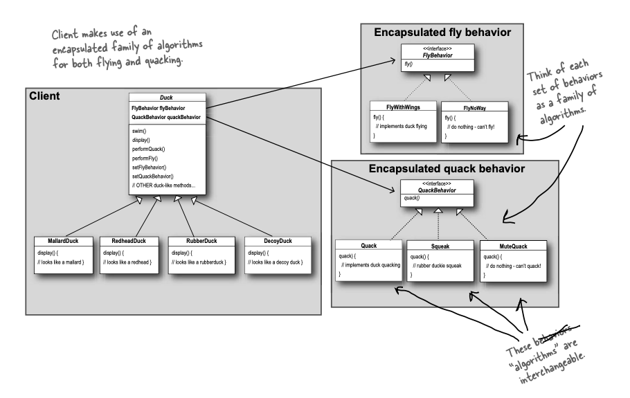
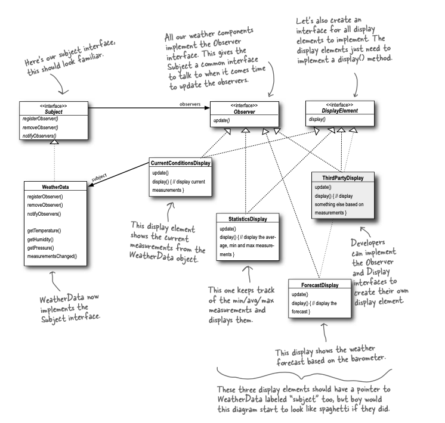
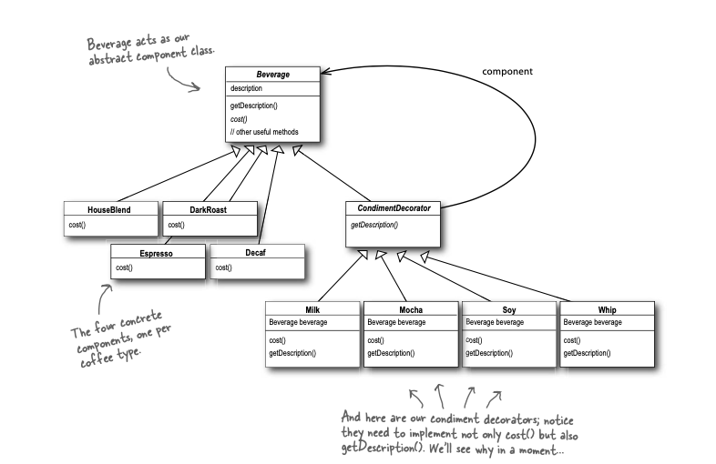
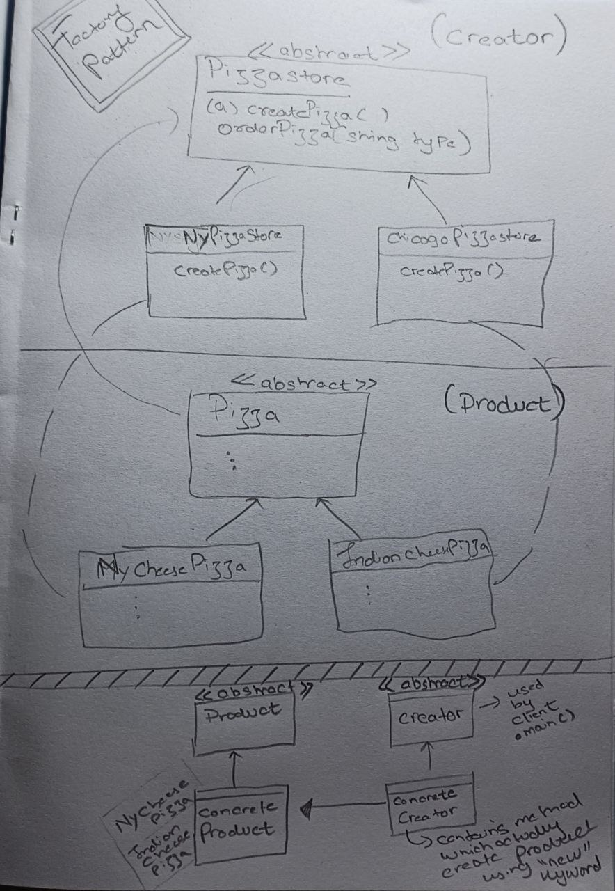
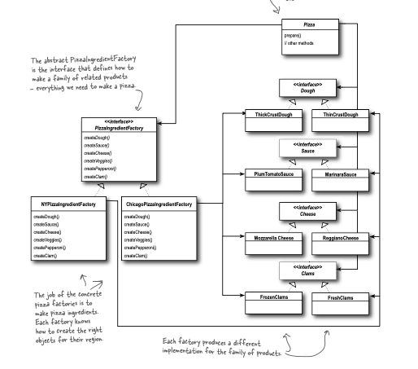

# Project Structure and Scripts

This repository contains examples of design patterns implemented in Java programming language. Additionally, it includes several shell scripts to help with project management and compilation.
(Switch to some other service provider(Except Jio) to load raw Images (for class Diagram), or else follow this step's https://developers.google.com/speed/public-dns/docs/using ).

## Table of Contents

1. [Project Structure](#project-structure)
2. [Shell Scripts](#shell-scripts)
3. [Contributing](#contributing)

## Project Structure

The projects in this repository should follow the following structure:


<pre>
<code>
    |- root folder 
	| - Project1
		| - Project1_MainFile.java 
	...other files and folders...
	| - Project2
		| - Project2_Main.java
	...other files and folders...
</code>
</pre>

Please ensure that your projects adhere to this structure to properly utilize the provided shell scripts.


## Requirements 
<pre>
<code>
	pip3 install tkinter 	
</code>
</pre>


## Shell Scripts

The repository includes the following shell scripts:

- `compile.sh`: Compiles all files in a Java project. This script prompts for the project name.
- `deleteclass.sh`: Deletes all class files in a project. **Caution:** This action is irreversible and should be used with care.
- `h_gen.sh`: Generates a package-level hierarchy for a given folder. This script prompts for the project name.
- `psh.sh`: Used to push files to a repository. It prompts for a commit message.
- `details.sh`: Provides information about the contents of the entire project.
- `run.py`: Runs a Python file for a GUI interface.
- `run.cpp`: Runs a C++ file for a menu-driven program.

Feel free to use these scripts to streamline your project management tasks.

## Contributing

Contributions to this repository are welcome! If you have any improvements, bug fixes, or additional scripts related to project management or design patterns, please feel free to submit a pull request. Ensure that your contributions follow the existing code style and provide clear documentation.

---

## Gallery


Thank you for your interest in this repository. I hope you find the provided examples and scripts helpful for your projects.


## Table of Contents

1. [Project Structure](#project-structure)
2. [Shell Scripts](#shell-scripts)
3. [Design Patterns](#design-patterns)
    - [Strategy Pattern](#strategy-pattern)
    - [Observer Pattern](#observer-pattern)
    - [Decorator Pattern](#decorator-pattern)
    - [Factory Pattern](#factory-pattern)


## Design Patterns

### Strategy Pattern

The Strategy pattern is a behavioral design pattern that enables selecting the behavior of an object at runtime. It encapsulates a family of algorithms, making them interchangeable. The pattern consists of a context object that can switch between different strategies based on the desired behavior.

Example:



```java

public interface FlyBehaviour {
	public void fly();
}

public interface QuackBehaviour{
	public void quack();
}


public abstract class Duck {
    // Properties FlyBehaviour and QuackBehaviour
   public  FlyBehaviour flyBehaviour;
    public QuackBehaviour quackBehaviour;

    public abstract void display();

    public void swim() {
        System.out.println("Swimming...");
    }

    public void performFly() {
        flyBehaviour.fly();
    }

    public void performQuack() {
        quackBehaviour.quack(); 
    }

    public void setBehaviour(FlyBehaviour _flyBehaviour, QuackBehaviour _quackBehaviour){
		flyBehaviour = _flyBehaviour;
		quackBehaviour = _quackBehaviour;
	}
}


//Creating a Duck
public class MallardDuck extends Duck {
    public MallardDuck() {
        flyBehaviour = new FlyWithWings();
        quackBehaviour = new MuteQuack();
    }

    @Override
    public void display() {
        System.out.println("Mallard Duck");
    }
}

//Usage 

	Duck duck = new MallardDuck();
        duck.display();
        duck.performFly();
        duck.performQuack();

        Duck duck2 = new ModelDuck();
        duck2.setBehaviour(new FlyWithWings(),new Quack());
        duck2.display();
        duck2.performFly();
        duck2.performQuack();


```

Benefits of using the Strategy pattern:

1. Promotes flexibility with dynamic behavior selection.
2. Simplifies adding or modifying algorithms without modifying the context.
3. Enhances code readability and maintainability by separating concerns.


### Observer Pattern

The Observer pattern is a behavioral design pattern that establishes a one-to-many dependency between objects. It allows multiple objects (observers) to be notified and updated automatically when the state of another object (subject) changes. The pattern decouples the observers from the subject, enabling loose coupling and maintainability.

Example :




```java

// Observable
public interface Subject{
	public void registerObserver(Observer o);
	public void removeObserver(Observer o);
	public void notifyObservers();
}

//Observer
public interface Observer{
	public void update(float temp, float humidity,float pressure);
}

//Implementation classes
//Observable
public class WeatherStation implements Subject{

	float temperature;
	float humidity;
	float pressure;
	ArrayList<Observer> observers;

	public WeatherStation(){
		observers = new ArrayList<Observer>();
	}


 @Override
	public void registerObserver(Observer o){
		observers.add(o);
	}
	
 @Override
	public void removeObserver(Observer o){
		int i = observers.indexOf(o);
		if (i >= 0) {
			observers.remove(i);
		 }
	}

 @Override
	public void notifyObservers(){
		for(int i = 0 ; i < observers.size() ; i++){
			observers.get(i).update(temperature,humidity,pressure);
		}
	}

	public void measurementsChanged() { 
		notifyObservers();
	}

	public void setMeasurements(float temperature, float humidity, float pressure) { 
		this.temperature = temperature;
		this.humidity = humidity;
		this.pressure = pressure;
		measurementsChanged(); 
	}	
}

//Observer (There can be Multiple Observers)
public class CurrentConditionDisplay implements Observer, Display {

	float temperature, humidity, pressure;
	Subject ws ;
	public CurrentConditionDisplay(Subject ws) {
		this.ws = ws;
		// TODO Auto-generated constructor stub
		ws.registerObserver(this);
	}

 @Override
	public void update(float temp, float humidity,float pressure){
		this.temperature = temp;
		this.humidity = humidity;
		this.pressure = pressure;
		display();
	}
 @Override
	public void display() {
		System.out.println("Current conditions: " + temperature + " F degrees and " + humidity + "% humidity");	
	}

}

//USAGE 
		WeatherStation ws = new WeatherStation();
		Observer currentDisplay = new CurrentConditionDisplay(ws); //subscribing 
		
		ws.setMeasurements(80, 65, 30.4f);
		ws.setMeasurements(81, 65, 30.4f);
		ws.setMeasurements(82, 65, 30.4f);
		
```

Benefits:

1. Enables loose coupling between objects, promoting flexibility and maintainability.
2. Supports one-to-many communication without the need for explicit dependencies.
3. Allows dynamic registration and removal of observers.


### Decorator Pattern
The Decorator pattern is a structural design pattern that allows adding new functionality to an object dynamically. It involves wrapping the original object with one or more decorator objects, which provide additional behaviors. The pattern provides an alternative to subclassing, enabling flexible extension of an object's functionality.

Example : 




```java 
// Abstract classes
public abstract class Beverage {
    public String desc = "Unknown Beverage";
    public String getDescription(){
	    return desc;
    }
    public abstract double cost();

}

public abstract class CondimentDecorators extends Beverage {
 public abstract String getDescription();
} 

//Decorators to add Extra layer of Functionality on Base Object(Beverage) using Decorator(CodimentDecorators).

//Base Object or Component
public class Espresso extends Beverage {

    public Espresso() {
        desc = "Espresso";
    }

    @Override
    public double cost() {
       return 1.99;
    }
}

//Decorator
public class Mocha extends CondimentDecorators {
    Beverage beverage;

    public Mocha (Beverage bevarage){
        this.beverage = bevarage;
    }

    @Override
    public double cost() {
        return beverage.cost() + 0.2;
    }

    @Override
    public String getDescription() {
        return beverage.getDescription() + ", Mocha";
    }
}

//USAGE 
  	Beverage beverage = new Espresso();
        beverage = new Mocha(beverage);
        beverage = new Mocha(beverage);

        System.out.println(beverage.getDescription() + " $" + beverage.cost());
	//Output Espresso, Mocha, Mocha, $2.19

```

Benefits:

1. Enables dynamic addition of behavior without modifying the original object.
2. Supports the Open-Closed principle by allowing extension without changing existing code.
3. Provides a flexible alternative to subclassing for adding functionality.


### Factory Pattern

#### Definition:

The Factory Method pattern is a creational design pattern that provides an interface for creating objects but allows subclasses to decide which class to instantiate.
It promotes loose coupling by allowing the creation of objects to be delegated to subclasses.
Purpose:

The Factory Method pattern is used when we want to create objects without specifying the exact class of the object that will be created.
It enables flexibility in object creation and decouples the client code from the concrete implementation of the objects.
Participants:

- Creator: This is an abstract class or interface that defines the factory method, which is responsible for creating the objects.
- ConcreteCreator: Subclasses of the Creator implement the factory method to create specific objects.
- Product: This is an abstract class or interface that defines the interface for the objects created by the factory method.
- ConcreteProduct: Subclasses of the Product represent the specific objects that are created by the ConcreteCreator.

How it works:

The client code interacts with the Creator through a common interface or abstract class.
The Creator class provides a factory method [ createPizza( ) ] that the client code can call to create an object. The factory method returns a Product object.

The Creator class is responsible for defining the interface for creating objects, but it delegates the actual creation to its subclasses.
Each subclass of the Creator overrides the factory method to create a specific type of Product object.

The client code only needs to know about the Creator and the abstract Product class/interface, without being aware of the specific concrete classes.

#### Advantages:
1. Encourages loose coupling between the client code and the object creation process.
2. Provides flexibility in object creation by allowing subclasses to determine the concrete class of the objects.
3. Enables the addition of new product variants or implementations without modifying existing client code.
4. Supports the "Open-Closed Principle" by allowing the addition of new Creator and ConcreteProduct subclasses without modifying existing code.

Use cases:

When there is a need for a common interface for creating objects, but the concrete classes are determined at runtime.
When the client code should not be dependent on specific classes and needs to be decoupled from the object creation process.
When there is a possibility of adding new product variants in the future without modifying the existing client code.

Example (factory Method Pattern) : 


```java

// INTERFACES and Abstact Classes
//Product
public abstract class Pizza {
	public String name,dough,sauce;
	public ArrayList<String> toppings = new ArrayList<>();

	void prepare(){
		System.out.println("Preparing "+name);
		System.out.println("Dough "+dough);
		System.out.println("Sauce "+sauce);
		System.out.println("Toppings");

		for(int i = 0 ; i < toppings.size() ; i++){
			System.out.println(" " +toppings.get(i));
		}
	}

	void bake(){
		System.out.println("Baking... ");
	}

	public void cut(){
		System.out.println("Cutting... ");
	}

	void box(){
		System.out.println("Boxing... ");
	}

	public String getName(){
		return name;
	}
}

// Creator
public abstract class PizzaStore {
	
    public Pizza orderPizza(String type){
	Pizza pizza = createPizza(type);
	pizza.prepare();
	pizza.bake();
	pizza.cut();
	pizza.box();

	return pizza;	
    }

    public abstract Pizza createPizza(String type);
}


// IMPLEMENTATION classes 
//Concrete Product
public class IndianCheesePizza extends Pizza {
	public IndianCheesePizza(){
		name = "Indian Cheese Pizza";
		dough = "Regular";
		sauce = "Tomato";
		toppings.add("Paneer");		
	}
}

public class NyCheesePizza  extends Pizza {
    
    public NyCheesePizza(){
	name = "Ny Cheese Pizza";
	dough = "Large";
	sauce = "Tomato & Onion";
	toppings.add("Extra Cheese");
    }

    @Override
    public void cut(){
	System.out.println("Cutting... Squares");
    }
}

//Concrete Creator
public class MyPizzaStore extends PizzaStore{
 @Override
	public  Pizza createPizza(String type){
		Pizza pizza ;
		if(type.equals("cheese")){
			return new IndianCheesePizza();
		}else 
		return new IndianCheesePizza();
	}
	
}

///Usage 
public class PizzaClient{
		public static void main(String[] args){

			PizzaStore myStore = new MyPizzaStore();
			PizzaStore nyStore = new NyPizzaStore();
			Pizza pizza = myStore.orderPizza("cheese");
			Pizza pizza2 = nyStore.orderPizza("cheese");
			System.out.println(pizza.getName());
			System.out.println(pizza2.getName());

	}
}

```


### Abstract Factory Pattern 


The Abstract Factory pattern is a creational design pattern that provides an interface for creating families of related or dependent objects without specifying their concrete classes. It allows you to encapsulate the process of object creation within a factory object, which is responsible for creating instances of related classes.

#### Theory:
The Abstract Factory pattern is based on the idea of creating object families or sets of related objects. These objects share a common theme or purpose and are designed to work together. The pattern introduces two main concepts: AbstractFactory and ConcreteFactory.

AbstractFactory: This is an interface or an abstract class that declares a set of creation methods for creating related objects. Each method in the AbstractFactory corresponds to a different type of object that the factory can create.

ConcreteFactory: This is a class that implements the AbstractFactory interface. It provides the actual implementation of the creation methods declared in the AbstractFactory. Each ConcreteFactory is responsible for creating a specific family of objects that are related to each other.

####  Advantages of the Abstract Factory pattern :

- Provides a high level of flexibility: The Abstract Factory pattern allows you to create families of related objects by simply changing the concrete factory implementation. This makes it easy to switch between different families of objects without impacting the client code that uses those objects.

- Encourages adherence to the Open-Closed Principle: The pattern promotes the Open-Closed Principle, which states that classes should be open for extension but closed for modification. By using the Abstract Factory pattern, you can introduce new types of products (objects) by creating new concrete factories, without modifying existing code.

Ensures consistent object creation: The Abstract Factory pattern guarantees that all objects created by a concrete factory are compatible and consistent with each other. This ensures that the resulting objects can work together seamlessly.

####  Usage of the Abstract Factory pattern:

- Creating platform-independent code: The Abstract Factory pattern is often used in frameworks or libraries that need to create objects that are platform-specific. By using an abstract factory, the code can be written in a platform-independent way, and the concrete factory implementation can be chosen at runtime based on the specific platform.

- Supporting multiple themes or styles: If your application needs to support different themes or styles, such as a light theme or a dark theme, you can use the Abstract Factory pattern to create sets of objects that correspond to each theme. This allows you to switch between themes dynamically without modifying the client code.

- Working with dependencies: The Abstract Factory pattern is useful when creating objects that have complex dependencies. Instead of creating these dependencies manually, the abstract factory can handle the creation and configuration of the entire family of objects, ensuring that the dependencies are correctly resolved.

Overall, the Abstract Factory pattern provides a way to create families of related objects with a consistent interface, promoting flexibility, extensibility, and maintainability in object-oriented systems.

Example : 


```java

// Product factory Interface and it's implementation

public interface PizzaIngredientFactory {
    public Dough createDough();
    public Sauce createSauce();
    public Cheese createCheese();
    public ArrayList<Veggies> createVeggies();
    public Pepproni createPepperoni();
    public Clams createClams();
}

// Chicago
public class ChicagoPizzaIngredientFactory implements PizzaIngredientFactory{
	
 @Override
	public Dough createDough(){
		return new ThickCrust();
	}
 @Override
	public Sauce createSauce(){
		return new TomatoSauce();
	}
 @Override
	public Cheese createCheese(){
		return new GoatCheese();
	}
 @Override
	public ArrayList<Veggies> createVeggies(){
		ArrayList<Veggies> veggies = new ArrayList<>();
		veggies.add(new Veggie("Veggies_chicago1"));
		veggies.add(new Veggie("Veggies_chicago2"));
		return veggies;
	}
 @Override
	public Pepproni createPepperoni(){
		return new PorkPepproni();
	}
 @Override
	public Clams createClams(){
		return new FreshClams();
	}
}

//NY
public class NyPizzaIngredientFactory  implements PizzaIngredientFactory{
	
 @Override
	public Dough createDough(){
		return new ThinCrust();
	}
 @Override
	public Sauce createSauce(){
		return new TomatoSauce();
	}
 @Override
	public Cheese createCheese(){
		return new MozzarellaCheese();
	}
 @Override
	public ArrayList<Veggies> createVeggies(){
		ArrayList<Veggies> veggies = new ArrayList<>();
		veggies.add(new Veggie("Veggies1"));
		veggies.add(new Veggie("Veggies2"));
		return veggies;
	}
 @Override
	public Pepproni createPepperoni(){
		return new BeefPepproni();
	}
 @Override
	public Clams createClams(){
		return new FreshClams();
	}
}

// Using factory  Ingredients Product's in PIZZA INTERFACE and IMPLEMENTATIONS
public abstract class Pizza {
	
	public String name;
	public Dough dough;
	public Sauce sauce;
	public ArrayList<Veggies> veggies;
	public Pepproni pepproni;
	public Cheese cheese ;
	public Clams clam ;

	public abstract void prepare();

	public void bake(){
		System.out.println("Baking... ");
	}

	public void cut(){
		System.out.println("Cutting... ");
	}

	public void box(){
		System.out.println("Boxing... ");
	}

	public void setName(String name){
		this.name = name;
	}

	public String getName(){
		return name;
	}

 	@Override
	public String toString(){
		return name;
	}
}

// Implementation of Pizza-Types

//CHEESE
public class CheesePizza extends Pizza{
	PizzaIngredientFactory ingredientFactory;
	
	public CheesePizza(PizzaIngredientFactory ingredientFactory){
		this.ingredientFactory = ingredientFactory;
		setName("Cheese Pizza");
	}

	

	public void prepare(){
		System.out.println("Preparing :" + name);
		dough = ingredientFactory.createDough();
		sauce = ingredientFactory.createSauce();
		veggies = ingredientFactory.createVeggies();
		pepproni = ingredientFactory.createPepperoni();
		cheese = ingredientFactory.createCheese();
	}
}

//CLAM
public class ClamPizza extends Pizza {
		PizzaIngredientFactory ingredientFactory;
		
		public ClamPizza(PizzaIngredientFactory ingredientFactory){
			this.ingredientFactory = ingredientFactory;
			setName("Clam Pizza");
		}
	
		public void prepare(){
			System.out.println("Preparing : " + name);
			dough = ingredientFactory.createDough();
			sauce = ingredientFactory.createSauce();
			veggies = ingredientFactory.createVeggies();
			pepproni = ingredientFactory.createPepperoni();
			cheese = ingredientFactory.createCheese();
		}
	}


// Defining FACTORY PRODUCTS using ITERFACE and IMPLEMENTATION (CORE ABSTRACT FACTORY PATTERN USAGE)
//check ingredients folder

//CHEESE - Interface
public abstract class Cheese {
    String desc = "cheese";
}

//CHEESE - IMPLEMENTATION
public class GoatCheese extends Cheese{
    public GoatCheese(){
	    System.out.print("GoatCheese");
    }
}

public class MozzarellaCheese extends Cheese {
	public MozzarellaCheese(){
		System.out.print("MozzarellaCheese");
	}
}

// ...Similarly for other Product's (INTERFACE,IMPLEMENTATION'S)...

//USAGE
System.out.println("PIZZA ABSTRACT FACTORY");

PizzaStore nyStore = new NyPizzaStore();
PizzaStore chicagoStore = new ChicagoPizzaStore();

System.out.println("*********************NEW YORK PIZZA*********************");
Pizza pizza_ny = nyStore.orderPizza("cheese");
System.out.println(pizza_ny.getName());

System.out.println("*********************CHICAGO PIZZA*********************");
Pizza pizza_c =  chicagoStore.orderPizza("clam");
System.out.println(pizza_c.getName());


```


#### Talk to me about

- Solving Data structure and algorithm questions in **C, C++ and Java**
- Front-end development using **HTML, CSS, JavaScript, XML In Android Java, Flutter**
- Backend development using **Dart-Flutter, NodeJs(Begineer), Java - Springboot**
- Database using **Firebase Firestore, Firebase Realtime Database, MongoDB, MYSQL**
- Android development using **Java, Kotlin, Flutter**
- Creating big and small projects using **Flutter, Shell-Scripts, C++, Java and Python**

##  To know More About me !!

- 💬 Ask me about anything and everything.
- Linkedin : https://www.linkedin.com/in/jaimitkumar-panchal-342883209/
- 🎯 Check out my Instagram page: [](https://www.instagram.com/jaimit_panchal/?hl=en)